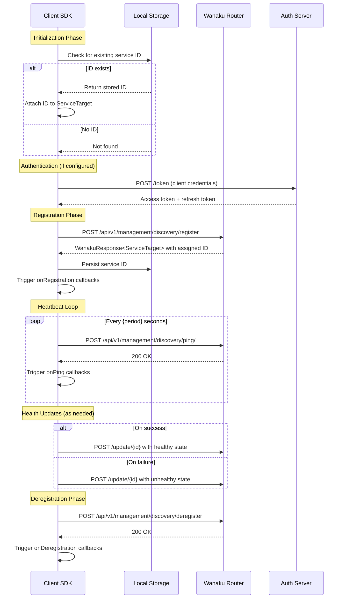

# Client Registration Flow

This document describes the service registration flow from the client (SDK) perspective. It serves as an implementation guide for developers building capabilities using the SDK or implementing registration clients in other languages.

## Overview

The Wanaku registration system enables capability services (tools, resources, code execution engines) to register themselves with the Wanaku Router. Once registered, services receive periodic health checks and can report their status back to the router.

### Key Concepts

| Concept | Description |
|---------|-------------|
| **ServiceTarget** | Represents a capability service endpoint with metadata |
| **ServiceState** | Point-in-time health snapshot of a service |
| **RegistrationManager** | Orchestrates the registration lifecycle |
| **DiscoveryCallback** | Receives lifecycle event notifications |

## Registration Flow Diagram

```
┌─────────────────────────────────────────────────────────────────────────────┐
│                         CLIENT REGISTRATION FLOW                            │
└─────────────────────────────────────────────────────────────────────────────┘

┌─────────────┐                                              ┌──────────────┐
│   CLIENT    │                                              │    ROUTER    │
│   (SDK)     │                                              │   (Server)   │
└──────┬──────┘                                              └──────┬───────┘
       │                                                            │
       │  ┌─────────────────────────────────────────────────────┐   │
       │  │ PHASE 1: INITIALIZATION                             │   │
       │  └─────────────────────────────────────────────────────┘   │
       │                                                            │
       ├──── Check local storage for existing service ID ────────►  │
       │     (dataDir/{serviceName}.wanaku.dat)                     │
       │                                                            │
       │  ┌─────────────────────────────────────────────────────┐   │
       │  │ PHASE 2: REGISTRATION                               │   │
       │  └─────────────────────────────────────────────────────┘   │
       │                                                            │
       ├──── POST /api/v1/management/discovery/register ──────────► │
       │     Body: ServiceTarget (without ID)                       │
       │     Auth: Bearer {token}                                   │
       │                                                            │
       │ ◄──── 200 OK ────────────────────────────────────────────┤
       │       Body: WanakuResponse<ServiceTarget> (with ID)        │
       │                                                            │
       ├──── Persist service ID locally ────────────────────────►   │
       │                                                            │
       ├──── Trigger onRegistration callback ─────────────────────► │
       │                                                            │
       │  ┌─────────────────────────────────────────────────────┐   │
       │  │ PHASE 3: HEARTBEAT (Periodic)                       │   │
       │  └─────────────────────────────────────────────────────┘   │
       │                                                            │
       ├──── POST /api/v1/management/discovery/ping/ ─────────────► │
       │     Body: service ID                                       │
       │                                                            │
       │ ◄──── 200 OK ────────────────────────────────────────────┤
       │                                                            │
       ├──── Trigger onPing callback ─────────────────────────────► │
       │                                                            │
       │  ┌─────────────────────────────────────────────────────┐   │
       │  │ PHASE 4: HEALTH UPDATES (As Needed)                 │   │
       │  └─────────────────────────────────────────────────────┘   │
       │                                                            │
       ├──── POST /api/v1/management/discovery/update/{id} ───────► │
       │     Body: ServiceState                                     │
       │                                                            │
       │  ┌─────────────────────────────────────────────────────┐   │
       │  │ PHASE 5: DEREGISTRATION                             │   │
       │  └─────────────────────────────────────────────────────┘   │
       │                                                            │
       ├──── POST /api/v1/management/discovery/deregister ────────► │
       │     Body: ServiceTarget                                    │
       │                                                            │
       │ ◄──── 200 OK ────────────────────────────────────────────┤
       │                                                            │
       ├──── Trigger onDeregistration callback ───────────────────► │
       │                                                            │
       ▼                                                            ▼
```

## Sequence Diagram



## API Endpoints

All endpoints use the base path: `/api/v1/management/discovery`

| Endpoint | Method | Request Body | Response | Description |
|----------|--------|--------------|----------|-------------|
| `/register` | POST | `ServiceTarget` | `WanakuResponse<ServiceTarget>` | Register service, receive assigned ID |
| `/deregister` | POST | `ServiceTarget` | Status code | Remove service from registry |
| `/update/{id}` | POST | `ServiceState` | Status code | Report health status |
| `/ping/` | POST | Service ID (string) | Status code | Send heartbeat signal |

### Authentication

All requests must include the `Authorization` header with a Bearer token:

```
Authorization: Bearer {access_token}
```

Token acquisition uses OAuth2 Client Credentials Grant:

```http
POST /token HTTP/1.1
Content-Type: application/x-www-form-urlencoded

grant_type=client_credentials&client_id={id}&client_secret={secret}
```

## Data Structures

### ServiceTarget

Represents a capability service endpoint.

```json
{
  "id": "550e8400-e29b-41d4-a716-446655440000",
  "serviceName": "my-tool",
  "host": "192.168.1.100",
  "port": 9090,
  "serviceType": "tool-invoker",
  "serviceSubType": "jvm",
  "languageName": "Java",
  "languageType": "compiled",
  "languageSubType": "jvm"
}
```

| Field | Type | Required | Description |
|-------|------|----------|-------------|
| `id` | string | No* | UUID assigned by server on registration |
| `serviceName` | string | Yes | Unique service identifier |
| `host` | string | Yes | IP address or hostname |
| `port` | int | Yes | gRPC service port |
| `serviceType` | string | Yes | Service category (see below) |
| `serviceSubType` | string | No | Engine variant (e.g., "jvm", "interpreted") |
| `languageName` | string | No | Implementation language |
| `languageType` | string | No | Language category |
| `languageSubType` | string | No | Language variant |

*ID is omitted on initial registration; server assigns it.

#### Service Types

| Type | Description |
|------|-------------|
| `tool-invoker` | Executes tool operations |
| `resource-provider` | Provides resources/data |
| `multi-capability` | Supports multiple capability types |
| `code-execution-engine` | Executes code in specific runtime |

### ServiceState

Point-in-time health snapshot.

```json
{
  "timestamp": "2025-01-15T10:30:00Z",
  "healthy": true,
  "reason": "healthy"
}
```

| Field | Type | Description |
|-------|------|-------------|
| `timestamp` | ISO-8601 | When the state was recorded |
| `healthy` | boolean | `true` = healthy, `false` = unhealthy |
| `reason` | string | Status message |

#### Standard Reasons

| Constant | Value | Usage |
|----------|-------|-------|
| `HEALTHY` | "healthy" | Normal operation |
| `MISSING_IN_ACTION` | "missing in action" | Service not responding |
| `AUTO_DEREGISTRATION` | "inactive due to service auto-deregistration" | Auto-removed |

### WanakuResponse

Generic response wrapper.

```json
{
  "error": null,
  "data": { /* ServiceTarget */ }
}
```

| Field | Type | Description |
|-------|------|-------------|
| `error` | WanakuError | Error details if request failed |
| `data` | T | Response payload (e.g., ServiceTarget) |

## Implementation Guide

### Step 1: Create Configuration

Configure the registration parameters:

```java
// Service configuration (server connection + auth)
DefaultServiceConfig serviceConfig = DefaultServiceConfig.Builder.newBuilder()
    .baseUrl("http://wanaku-router:8080")
    .serializer(new JacksonSerializer())
    .clientId("my-service-client")
    .secret("client-secret")
    .tokenEndpoint("http://auth-server/realms/wanaku/protocol/openid-connect/token")
    .build();

// Registration configuration (lifecycle settings)
DefaultRegistrationConfig registrationConfig = DefaultRegistrationConfig.Builder.newBuilder()
    .maxRetries(3)           // Retry registration up to 3 times
    .waitSeconds(5)          // Wait 5 seconds between retries
    .dataDir("/var/lib/myservice")  // Where to persist service ID
    .initialDelay(0)         // Start immediately
    .period(30)              // Ping every 30 seconds
    .build();
```

### Step 2: Create ServiceTarget

Define your service endpoint:

```java
// Resolve the registration address (handles auto IP detection)
String address = DiscoveryHelper.resolveRegistrationAddress(announceAddress);

// Create service target (ID will be assigned by server)
ServiceTarget serviceTarget = ServiceTarget.newEmptyTarget(
    "my-awesome-tool",    // Service name
    address,              // Host/IP
    9090,                 // gRPC port
    "tool-invoker"        // Service type
);
```

### Step 3: Create HTTP Client

```java
DiscoveryServiceHttpClient httpClient = new DiscoveryServiceHttpClient(serviceConfig);
```

### Step 4: Create Registration Manager

```java
ZeroDepRegistrationManager registrationManager = new ZeroDepRegistrationManager(
    httpClient,
    serviceTarget,
    registrationConfig,
    new JacksonDeserializer()
);
```

### Step 5: Add Lifecycle Callbacks (Optional)

```java
registrationManager.addCallBack(new DiscoveryCallback() {
    @Override
    public void onRegistration(RegistrationManager manager, ServiceTarget target) {
        log.info("Registered with ID: {}", target.id());
    }

    @Override
    public void onPing(RegistrationManager manager, ServiceTarget target, int status) {
        log.debug("Ping completed with status: {}", status);
    }

    @Override
    public void onDeregistration(RegistrationManager manager, ServiceTarget target, int status) {
        log.info("Deregistered with status: {}", status);
    }
});
```

### Step 6: Start Registration

```java
registrationManager.start();
```

This initiates:
1. Initial registration attempt (with retries)
2. Periodic heartbeat loop
3. Automatic ID persistence

### Step 7: Report Health Status

During operation, report your service health:

```java
// On successful operation
registrationManager.lastAsSuccessful();

// On failure
registrationManager.lastAsFail("Database connection lost");
```

### Step 8: Deregister on Shutdown

```java
// In shutdown hook or @PreDestroy
registrationManager.deregister();
```

## State Machine

```
                                  ┌─────────────┐
                                  │             │
                        ┌────────►│  REGISTERED │◄────────┐
                        │         │             │         │
                        │         └──────┬──────┘         │
                        │                │                │
                   register()        deregister()    ping() success
                        │                │                │
                        │                ▼                │
┌─────────────┐         │         ┌─────────────┐         │         ┌─────────────┐
│             │         │         │             │         │         │             │
│   INITIAL   ├─────────┘         │ DEREGISTERED│         └─────────┤   ACTIVE    │
│             │                   │             │                   │             │
└─────────────┘                   └─────────────┘                   └──────┬──────┘
                                                                          │
                                                                     ping() sent
                                                                          │
                                                                          ▼
                                                                   ┌─────────────┐
                                                                   │             │
                                                                   │  PINGING    │
                                                                   │             │
                                                                   └─────────────┘
```

## Error Handling

### Registration Failures

The registration manager implements retry logic:

1. Attempt registration
2. On failure, wait `waitSeconds`
3. Retry up to `maxRetries` times
4. Log warning on each failure
5. Continue attempting on schedule even after max retries

### Network Errors

Handle HTTP errors appropriately:

| Status | Meaning | Action |
|--------|---------|--------|
| 200 | Success | Continue normal operation |
| 401 | Unauthorized | Refresh OAuth token |
| 404 | Not found | Service may have been removed; re-register |
| 500+ | Server error | Retry with backoff |

### Token Expiration

The SDK automatically handles token refresh:
- Tokens are refreshed 30 seconds before expiration
- Uses refresh token if available
- Falls back to client credentials grant

## ID Persistence

Service IDs are persisted locally to survive restarts:

```
{dataDir}/{serviceName}.wanaku.dat
```

File format (binary):
- File header (magic bytes + version)
- Service entry: 36-byte UUID + 4 bytes padding

This allows:
- Service to maintain same ID across restarts
- Router to recognize returning services
- Continuous activity tracking

## Configuration Reference

### RegistrationConfig

| Parameter | Type | Default | Description |
|-----------|------|---------|-------------|
| `maxRetries` | int | 3 | Maximum registration retry attempts |
| `waitSeconds` | int | 1 | Seconds between retry attempts |
| `dataDir` | string | - | Directory for ID persistence |
| `initialDelay` | long | 0 | Seconds before first registration |
| `period` | long | 5 | Seconds between heartbeats |

### ServiceConfig

| Parameter | Type | Description |
|-----------|------|-------------|
| `baseUrl` | string | Wanaku Router base URL |
| `serializer` | Serializer | JSON serializer implementation |
| `clientId` | string | OAuth2 client ID |
| `secret` | string | OAuth2 client secret |
| `tokenEndpoint` | string | OAuth2 token endpoint URL |

## Complete Example

```java
public class CapabilityService {
    private RegistrationManager registrationManager;

    public void start() {
        // 1. Configure service connection
        DefaultServiceConfig serviceConfig = DefaultServiceConfig.Builder.newBuilder()
            .baseUrl("http://wanaku-router:8080")
            .serializer(new JacksonSerializer())
            .clientId("my-capability")
            .secret("secret")
            .tokenEndpoint("http://keycloak:8080/realms/wanaku/protocol/openid-connect/token")
            .build();

        // 2. Configure registration behavior
        DefaultRegistrationConfig registrationConfig = DefaultRegistrationConfig.Builder.newBuilder()
            .maxRetries(5)
            .waitSeconds(3)
            .dataDir("/var/lib/my-capability")
            .initialDelay(0)
            .period(30)
            .build();

        // 3. Define service endpoint
        ServiceTarget target = ServiceTarget.newEmptyTarget(
            "my-capability",
            "192.168.1.50",
            9090,
            "tool-invoker"
        );

        // 4. Create HTTP client
        DiscoveryServiceHttpClient httpClient = new DiscoveryServiceHttpClient(serviceConfig);

        // 5. Create and start registration manager
        registrationManager = new ZeroDepRegistrationManager(
            httpClient,
            target,
            registrationConfig,
            new JacksonDeserializer()
        );

        registrationManager.addCallBack(new DiscoveryLogCallback());
        registrationManager.start();
    }

    public void reportSuccess() {
        registrationManager.lastAsSuccessful();
    }

    public void reportFailure(String reason) {
        registrationManager.lastAsFail(reason);
    }

    public void shutdown() {
        registrationManager.deregister();
    }
}
```

## SDK Classes Reference

| Class | Module | Purpose |
|-------|--------|---------|
| `RegistrationManager` | capabilities-api | Core registration interface |
| `ZeroDepRegistrationManager` | capabilities-discovery | Zero-dependency implementation |
| `DiscoveryServiceHttpClient` | capabilities-discovery | HTTP client for discovery API |
| `ServiceTarget` | capabilities-api | Service endpoint representation |
| `ServiceState` | capabilities-api | Health state representation |
| `DiscoveryCallback` | capabilities-api | Lifecycle event callbacks |
| `DefaultRegistrationConfig` | capabilities-discovery | Registration configuration |
| `DefaultServiceConfig` | capabilities-common | Service/auth configuration |
| `InstanceDataManager` | capabilities-data-files | Service ID persistence |

## See Also

- [Server-side Registration Flow](https://github.com/wanaku-ai/wanaku/blob/main/docs/internals-service-registration.md)
- [SDK Usage Guide](usage.md)
